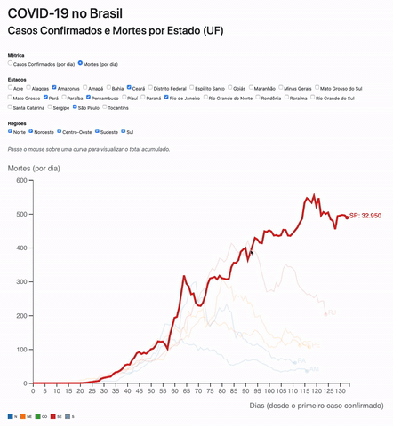

# COVID-19 no Brasil

Visualização interativa de casos confirmados e mortes por COVID-19 no Brasil. 

## Site

O gráfico interativo acima está disponível online em [https://lucasrla.github.io/covid-19-brasil/](https://lucasrla.github.io/covid-19-brasil/).

É atualizado diaria e automaticamente com os [dados mais recentes do Brasil.io](https://brasil.io).

## Observable Notebooks

Os notebooks utilizados (por trás dos panos) no site são código-aberto e estão disponível online em [https://observablehq.com/collection/@lucasrla/covid-19](https://observablehq.com/collection/@lucasrla/covid-19).

## Streamlit

Uma versão alternativa do site com os notebooks _embedded_ ("embutidos") está disponível em [https://share.streamlit.io/lucasrla/covid-19-brasil/master/app.py](https://share.streamlit.io/lucasrla/covid-19-brasil/master/app.py).

## Agradecimentos

- [Brasil.io e voluntários](https://data.brasil.io/dataset/covid19/_meta/list.html) pela coleta dos dados
- [Yong-Yeol Ahn](http://yongyeol.com) pelo [Observable notebook](https://observablehq.com/@yy/covid-19-spreading-trends) em que me inspirei

## Licença

Este projeto é distribuído sob a licença [GNU GPLv3](https://www.gnu.org/licenses/gpl-3.0.pt-br.html).